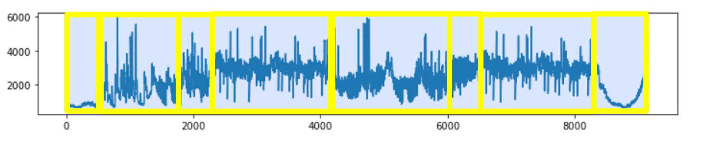
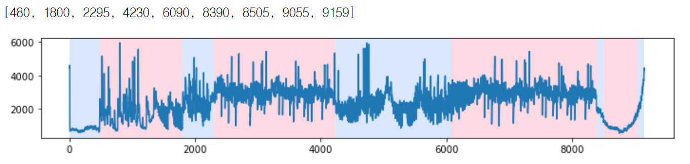
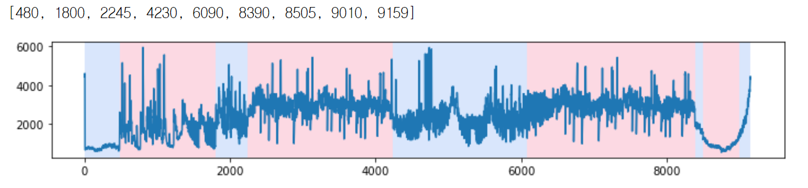
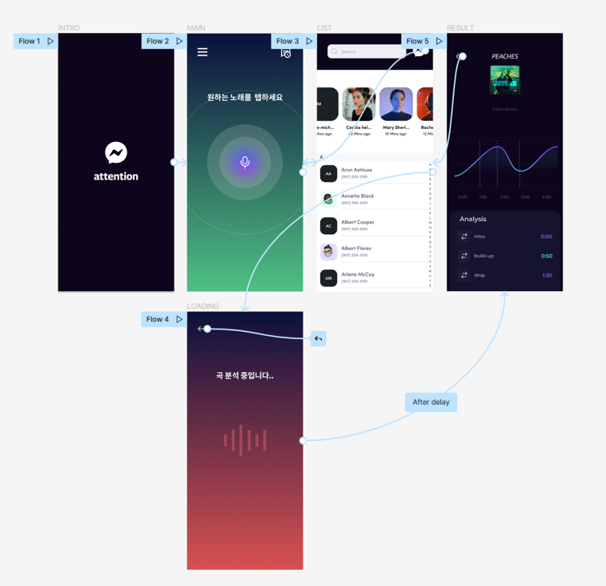

# Structual-Segmentation App based on Spectral centroid

## About the Project
최근 유행하는 15초에서 10분 사이의 동영상 숏폼(short form)에서 사용자는 짧은 시간 동안 자신의 콘텐츠와 어울리는 음악 구간과 타이밍을 직접 찾아서 재생해야 하는 어려움이 있다. 본 연구에서는 이런 불편한 점을 개선하기 위해 2가지 기술적 목표를 가지고 있다. 첫 번째는, 최신 곡 유행 트렌드에 잘 맞고 사용자가 간편하게 이용할 수 있는 Spectral centroid 변화 감지를 이용한 곡 구조 분해(structural segmentation) 기능의 구현이다. 두 번째는, 이미 선정된 곡에 대하여 사용자의 콘텐츠와 어울리는 곡의 구간을 찾기 위해 사용자의 표정인식을 이용한 감정 태그로 구간을 매핑시키는 것이다. 이와 같은 기능을 구현한 어플리케이션을 제안하여 콘텐츠 시장의 다양화와 기술적 성취에 기여한다

## 기존 연구 문제점 및 해결 방안
기존의 SSM(structural similarity matrix)방식과 같이 각각 다른 피처(MFCC, RMS)를 뽑아내서 다시 pairwise 하는 작업은 복잡하다. 
또한 요즘에는 메인 구간에서 오히려 악기 구성을 단순화시켜서 전체적인 
사운드가 비게 하는 경우가 많기 때문에, RMS 의 레벨로 main 과 나머지 섹션을 나누는 것은 문제가 있다. 따라서 RMS 를 이용한 Labeling보다는 곡 변화 자체를 감지
할 수 있는 방안이 필요하다. 

문제를 정리하면 다음과 같다. 
1) SSM은 복잡도가 커서 곡 분석에 불리하다. 
2) 요즘 곡은 편곡 방식이 다양해서, RMS가 높다고 main 구간으로 보기는 어렵다. 

## Spectral centroid를 이용한 segmentation Experiment Result

  
<b>Figure 1.</b> Ground truth.

  
<b>Figure 2.</b> dynp point detection.

  
<b>Figure 3.</b> pelt point detection.

## Application architecture

  
<b>Figure 4.</b> UI/UX.

## Refernce
[1] Vande Veire and De Bie, “From raw audio to a seamless mix: creating an automated DJ system for Drum and Bass”, EURASIP Journal on Audio, Speech, and Music Processing, 2018
[2] Charles Truonga, Laurent Oudreb, Nicolas Vayatis, “Selective review of offline change point detection methods”, Accepted to Signal Processing, 2020
[3] https://github.com/omar178/Emotion-recognition
[4] https://github.com/oarriaga/face_classification
[5] Tommy Swindali, “Music Production: The Advanced Guide On How to Produce for Music Producers”,2019